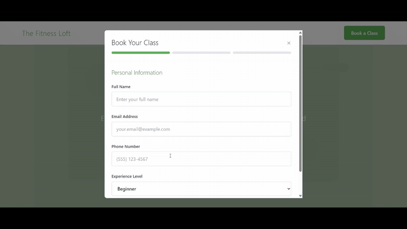

# Pilates Studio Client Booking System

A full-stack web application featuring a landing page and booking management system for a Pilates studio. Built with modern web technologies and Firebase for real-time data management.

## Features
- Professional landing page showcasing studio services
- Real-time class booking system
- User authentication and authorization
- Responsive design for mobile and desktop
- Booking confirmation and management
- Class schedule visualization

## Tech Stack

**Frontend:**
- React
- JavaScript
- TailwindCSS
- CSS3

**Backend & Database:**
- Firebase Authentication
- Firebase Firestore (NoSQL database)
- Firebase Hosting

**Development Tools:**
- Node.js
- npm
- PostCSS

## Demo

### Landing Page


### Booking System


## Installation & Setup

### Prerequisites
- Node.js (v14 or higher)
- npm
- Firebase account

### Local Development

1. Clone the repository:
```
git clone https://github.com/ThirushanPather/client-booking-system.git
cd client-booking-system
```

2. Install dependencies:
```
npm install
```

3. Create a .env file in the root directory and add your Firebase configuration:
```
REACT_APP_FIREBASE_API_KEY=your_api_key
REACT_APP_FIREBASE_AUTH_DOMAIN=your_auth_domain
REACT_APP_FIREBASE_PROJECT_ID=your_project_id
REACT_APP_FIREBASE_STORAGE_BUCKET=your_storage_bucket
REACT_APP_FIREBASE_MESSAGING_SENDER_ID=your_sender_id
REACT_APP_FIREBASE_APP_ID=your_app_id
```

4. Start the development server:
```
npm start
```
5. Open http://localhost:3000 in your browser

## Key Features Breakdown
### Landing Page:

- Hero section with studio introduction
- Services and class offerings
- Instructor profiles
- Pricing information
- Contact section

### Booking System:

- Browse available classes
- Real-time availability checking
- Easy booking interface
- Booking confirmation

## Firebase Configuration
This application uses Firebase for:

Authentication: Secure user login and registration
Firestore: Real-time database for bookings and class data
Hosting: Optional deployment platform

